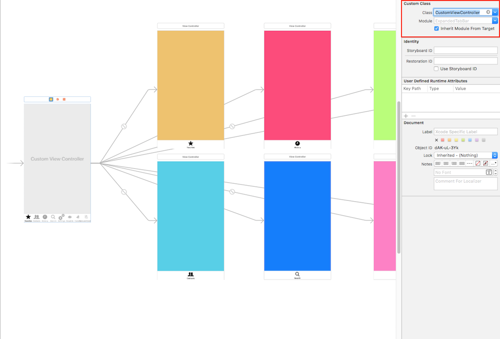
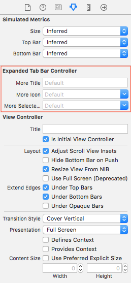

# ExpandedTabBar v2.0.2

### ExpandedTabBar is a very creative designed solution for "more" items in UITabBarController


## Requirements

* iOS 11.0+
* Swift 5.x
* Xcode 10+

## Installation

#### [CocoaPods](https://cocoapods.org/)

```ruby
pod 'ExpandedTabBar'
```

## How to use

To setup the component you should
1) create `UITabBarController`
2) extend from `ExpandedTabBarController`
3) set to `UITabBarController` in storyboard



You can customize more tab in storyboard



To customize view you should change options with `ExpandedTabBarOptions` and `ExpandedTabBarShadowOptions`,
```swift
    //MARK :- ExpandedTabBarOptions

    /// Background view options
    backgroundColor: UIColor // Default .black
    backgroundAlpha: CGFloat // Default 0.4
    closeOnTap     : Bool    // Default true

    /// List's container options
    containerBackgroundColor: UIColor                      // Default .white
    containerBackgroundAlpha: CGFloat                      // Default 1.0
    containerCornerRadius   : CGFloat                      // Default 5.0
    containerBottomMargin   : CGFloat                      // Default 15.0
    containerItemsSpace     : CGFloat                      // Default 8.0
    shadow                  : ExpandedTabBarShadowOptions? // Default nil

    /// Item View Options
    titleFont             : UIFont            // Default .systemFont(ofSize: 16)
    titleColor            : UIColor           // Default .black
    iconColor             : UIColor           // Default .black
    itemHeight            : CGFloat           // Default 35.0
    imageContentMode      : UIViewContentMode // Default .scaleAspectFit
    spaceBetweenImageTitle: CGFloat           // Default 8.0


    // MARK :- ExpandedTabBarShadowOptions

    color  : UIColor // Default .black
    offset : CGSize  // Default .zero
    opacity: Float   // Default 0.5
    radius : CGFloat // Default 5.0
```

For tab selection action please implement  `ExpandedTabBarControllerDelegate`:

```swift

func expandedTabBarController(
    _ tabBarController: UITabBarController, 
    didSelect viewController: UIViewController, 
    withItem tabBarItem: UITabBarItem?
)
```


### Example
```swift
import UIKit
import ExpandedTabBar

class CustomViewController: ExpandedTabBarController {

    override func viewDidLoad() {
        super.viewDidLoad()
        expandedDelegate = self
        initOptions()
    }

    func initOptions() {
        var options = ExpandedTabBarOptions()
        options.backgroundAlpha = 0.3
        options.shadow = .default
        options.containerItemsSpace = 15
        options.spaceBetweenImageTitle = 15
        self.options = options
    }
}

extension CustomViewController: ExpandedTabBarControllerDelegate {
    func expandedTabBarController(_ tabBarController: UITabBarController, didSelect viewController: UIViewController, withItem tabBarItem: UITabBarItem?) {
        // Do some logic here
    }
}
```

## Support

Feel free to [open issuses](https://github.com/yervandsar/ExpandedTabBar/issues/new) with any suggestions, bug reports, feature requests, questions.

## Let us know!

We’d be really happy if you sent us links to your projects where you use our component. Just send an email to yervandsar@gmail.com And do let us know if you have any questions or suggestion regarding the animation.


### License

The MIT License (MIT)

Copyright (c) 2018 Yervand

Permission is hereby granted, free of charge, to any person obtaining a copy
of this software and associated documentation files (the "Software"), to deal
in the Software without restriction, including without limitation the rights
to use, copy, modify, merge, publish, distribute, sublicense, and/or sell
copies of the Software, and to permit persons to whom the Software is
furnished to do so, subject to the following conditions:

The above copyright notice and this permission notice shall be included in all
copies or substantial portions of the Software.

THE SOFTWARE IS PROVIDED "AS IS", WITHOUT WARRANTY OF ANY KIND, EXPRESS OR
IMPLIED, INCLUDING BUT NOT LIMITED TO THE WARRANTIES OF MERCHANTABILITY,
FITNESS FOR A PARTICULAR PURPOSE AND NONINFRINGEMENT. IN NO EVENT SHALL THE
AUTHORS OR COPYRIGHT HOLDERS BE LIABLE FOR ANY CLAIM, DAMAGES OR OTHER
LIABILITY, WHETHER IN AN ACTION OF CONTRACT, TORT OR OTHERWISE, ARISING FROM,
OUT OF OR IN CONNECTION WITH THE SOFTWARE OR THE USE OR OTHER DEALINGS IN THE
SOFTWARE.
